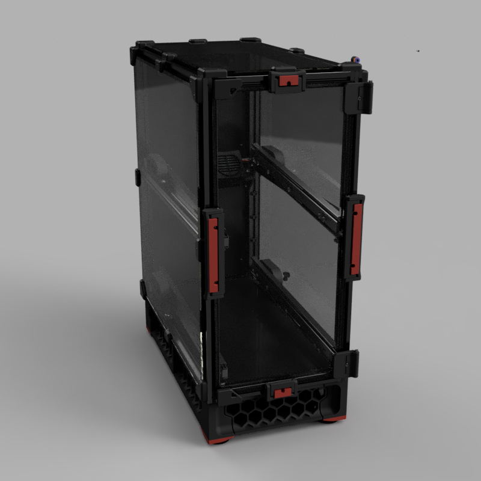
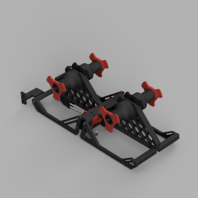
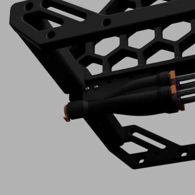
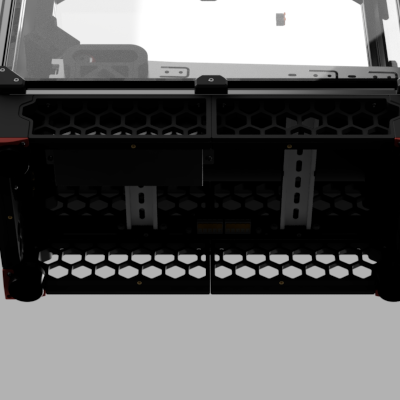

 <!---->
 

# Yet Another MMU
"Eight Materials, Twin Drawers, One Enclosure."

A Multi-Material Unit (MMU) for eight filaments that can also function as a filament dryer, keeping them dry while printing. The design is heavily inspired by Voron and their printers.

</img>

# Introduction
Currently, this project aims to support loading and unloading filament before a print begins. While it is technically possible to use this version for multi-color or multi-material prints, this is not our focus at the moment. We plan to support both options in the future, once we have a reliable working prototype.

# Features
- Multi-Material Unit for FFF
- Filament loading and unloading via powerful BLDC motors
- Enclosed Heated Filament Storage Built with 2020 Extrusion
- Separate electronics bay, similar to the one in the Voron 2.4
- Strongly inspired by the Voron 2.4 and Trident, this design seamlessly blends in when placed next to a Voron printer. Additionally, it supports the use of Voron user modifications.

</img>

The YAMMU system features two identical feeders that take inspiration from Baboo Labs' "First Stage Loader." A key design advantage is the relatively short inlet tube, which simplifies the filament loading process and makes it exceptionally convenient. This practical design element sets it apart from other MMUs, as these feeders not only handle the initial loading of the filament but also seamlessly guide it directly into the extruder. As a result of this integrated functionality, a relatively large BLDC motor is required to ensure efficient operation and maintain consistent performance throughout the filament loading process. This approach not only enhances the user experience but also contributes to the overall reliability and effectiveness of the system.

</img>

The filament is operated by two micro servos, which provide precise control and adjustability. These micro servos ensure that the filament functions efficiently and reliably. By utilizing these servos, the system achieves a high level of performance, making it suitable for various applications.

</img>

After passing through the feeder, the filament reaches the splitter. This component contains a filament switch that is triggered when a filament is present. If the switch does not trigger after loading a filament, it indicates a problem, and we can halt the print. Once any potential problems are cleared, the print can then be resumed.

</img>

Last stage for loading filament is the tool head. Here a filament sensor must be present so the YAMMU knows when to switch off the BLDC motor. A suitable modification for the Stealthburner / Clockwork 2 can be found [here](https://github.com/Enraged-Rabbit-Community/ERCF_v2/blob/master/Recommended_Options/Toolhead_Modifications/Stls/1_Toolhead_And_Entry_Sensors/SB_CW2_Body.stl) or [a modified version here](STls/Toolhead_Modifications).

</img>

Naturally, the filament chamber is meticulously sealed to ensure optimal conditions, and it is precisely heated to maintain the necessary temperature for efficient operation.

</img>

And all electronic components are organized in an electronics bay, much like the design of a Voron printer.

# Electronics
For YAMMU, we require a significant number of PWM ports along with several inputs for RPM, filament sensors, and other components. Currently, there's no available mainboard that meets all these requirements.
So, we've decided to take matters into our own hands and build our own MCU. Imagine it as a specialized hub, tailored just for us — packed with all the essential features we need for our project.
It's going to be custom-made to fit our specific needs, ensuring we have everything required to innovate without compromise.

[oshwlab.com](https://oshwlab.com/tpuchinger/mmu-control-board-v3-1)

# Current state
We are currently gearing up to release the first teaser, version 0.1. At this stage, not everything is running smoothly just yet, so we could really use your help! If you have skills in CAD, electronics, coding, or if you simply have a few hours to spare for testing the current iteration, we'd love to hear from you.

Your input and feedback can make a huge difference, and we’re excited to have the community involved in this journey. Feel free to reach out to me directly if you're interested in contributing. And if you're comfortable with GitHub, pull requests are also more than welcome!

## v1.0

- Manual Loading, e.g. Loading and Unloading filament before a print is started
- Automatic Loading, e.g. Loading and Unloading filament at the start of a print, for example as a "Filament Start Gcode" in OrcaSlicer
- Heating the Chamber for Drying Filament
- Electronics on Custom PCB

## v2.0

- All of the above
- Supporting the Extruder via the BLDC motor. When the extruder pulls the filament, the BLDC motor pushes it, and vice versa.

# Help needed
We're on the lookout for some awesome people to join our project and give us a hand with a few exciting tasks. If you're into testing, we'd love your help to make sure everything's running smoothly. Got a flair for electronics? Perfect! We could use your expertise to innovate and troubleshoot some cool hardware. And if writing is your thing, we could definitely use some help creating clear and engaging documentation. Whether you're a pro or just keen to dive in and learn, we'd be thrilled to have you onboard to help us keep things moving!

# Used Open Source Parts
- Parts from [Voron Trident](https://github.com/VoronDesign/Voron-Trident)
by Voron Design is licensed under the GNU GENERAL PUBLIC LICENSE Version 3
- Parts from [ERCF v2](https://github.com/Enraged-Rabbit-Community/ERCF_v2)
by Enraged Rabbit Community is licensed under the GNU GENERAL PUBLIC LICENSE Version 3
- Parts from [Integrated Auto-Rewind Spool Holder](https://www.thingiverse.com/thing:3781815)
by VincentGroenhuis is licensed under the Creative Commons - Attribution - Share Alike license.
- Parts from [Voron 2.4 Front Panel Handle, Hinge & Magnet Latch](https://www.printables.com/model/371692-voron-24-front-panel-handle-hinge-magnet-latch/files)
by Jason_116929 is licensed under the Creative Commons - Attribution - Share Alike license.
- Parts from [Kit for Removable Panels/Doors for Voron V2/Trident using Strong Snap Latch](https://www.printables.com/model/702768-kit-for-removable-panelsdoors-for-voron-v2trident-/files)
by Victor Mateus Oliveira is licensed under the GNU GENERAL PUBLIC LICENSE Version 3
- Parts from [WAGO 221-415 extrusion mount](https://www.printables.com/model/869020-wago-221-415-extrusion-mount-1by5-and-2by5)
by Artxime is licensed under the GNU GENERAL PUBLIC LICENSE Version 3
- Parts from 
by #### is licensed under the ####.

# Keep Browsing
Is YAMMU not the ideal MMU for you? Consider these alternatives:
- [ERCF v2](https://github.com/Enraged-Rabbit-Community/ERCF_v2): ERCF V1.1 served as my original MMU and inspired the development of YAMMU.
- [8-Track](https://github.com/ArmoredTurtle/8-Track-Raven-Alpha)
- [Primitive Infinite Spool System](https://github.com/Esoterical/PrinterMods/tree/main/Primitive%20Infinite%20Spool%20System)
- [TradRack](https://github.com/Annex-Engineering/TradRack)
- Prusa MMU3
